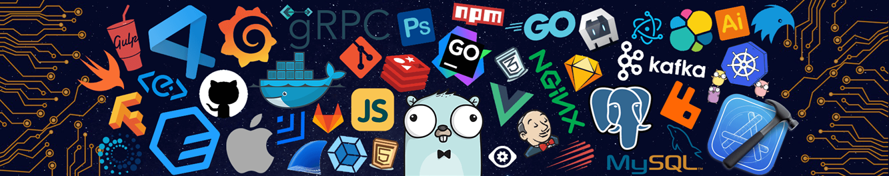

<!-- ╔══════════════════════════════════════════════════════════════════════╗
     ║  BHARGAVA A — GitHub Profile README                                 ║
     ║  Username: bhargava562 | LinkedIn: bhargavaa1 | LC: Bhargava2525    ║
     ╚══════════════════════════════════════════════════════════════════════╝ -->

<!-- ====================================================================== -->

<!-- THEME-AWARE HERO                                                       -->

<!-- ====================================================================== -->
<p align="center">
  
</p>

<picture>
  <source
    media="(prefers-color-scheme: dark)"
    srcset="https://raw.githubusercontent.com/bhargava562/bhargava562/main/dark.svg"
  />
  <source
    media="(prefers-color-scheme: light)"
    srcset="https://raw.githubusercontent.com/bhargava562/bhargava562/main/light.svg"
  />
  
</picture>

<br/>

<!-- ====================================================================== -->

<!-- SOCIAL RAIL                                                            -->

<!-- ====================================================================== -->

<p align="center">

  <a href="https://bhargavaa.vercel.app/">
    
  </a>

  <a href="https://www.linkedin.com/in/bhargavaa1/">
    
  </a>

  <a href="https://leetcode.com/Bhargava2525/">
    
  </a>

  <a href="https://github.com/bhargava562">
    
  </a>

  <a href="https://x.com/Bhargava3196511">
    
  </a>

  <a href="mailto:bhargavaanand2006@gmail.com">
    
  </a>

</p>

<p align="center">
  
</p>

<br/>

<!-- ====================================================================== -->

<!-- SYSTEM INFO PANEL                                                      -->

<!-- ====================================================================== -->

<table align="center" width="100%">
<tr>
<td width="55%" valign="top">

```yaml
$ whoami --verbose

name       : Bhargava A
role       : Python Backend Developer Intern @ Linkific
identity   : "Centaur Engineer" — AI as force multiplier,
             not a replacement for engineering judgment
college    : R.M.K. Engineering College
degree     : B.Tech, CS & Business Systems | '24–'28
cgpa       : 8.75 / 10
location   : Chennai, India
principle  : ship the boring 80%, own the hard 20%
```

<h3>🧠 Currently Compiling</h3>

* ⚙️ Production **FastAPI** backend @ Linkific — auth, scoring engine, test suite
* 📐 **30-pattern DSA sprint** (15 weeks) — past Sliding Window, mid Prefix Sum
* 🛰️ **Orbit** — request-time health-aware credential failover platform (Java/Spring Boot)
* ✍️ Weekly engineering deep-dives on LinkedIn — real problems, not tutorials

</td>

<td width="45%" align="center" valign="top">


</td>
</tr>
</table>

<p align="center">
  
</p>

<br/>

<!-- ====================================================================== -->

<!-- STACK                                                                  -->

<!-- ====================================================================== -->

<h2 align="center">
  
</h2>

<table align="center" width="94%">
<tr>

<td align="center" width="50%">

**Languages**

<br/>

<a href="https://skillicons.dev">
  
</a>

<br/><br/>

**Frameworks**

<br/>

<a href="https://skillicons.dev">
  
</a>

</td>

<td align="center" width="50%">

**Data & Infra**

<br/>

<a href="https://skillicons.dev">
  
</a>

<br/><br/>

**Tools**

<br/>

<a href="https://skillicons.dev">
  
</a>

</td>

</tr>
</table>

<p align="center">
  
  
  
  
  
</p>

<br/>

<picture>
  <source
    media="(prefers-color-scheme: dark)"
    srcset="https://capsule-render.vercel.app/api?type=soft&color=0:0891B2,100:00FF9C&height=4&section=header"
  />
  
</picture>

<br/>

<!-- ====================================================================== -->

<!-- EXPERIENCE                                                             -->

<!-- ====================================================================== -->

<h2 align="center">
  
</h2>

<table align="center" width="94%">
<tr>
<td width="100%">

**`[Apr 2026 → Aug 2026]`**   **Python Backend Developer Intern** — Linkific

    → Built a production FastAPI backend from scratch (Gritt app) — JWT / RBAC / bcrypt / Google OAuth 2.0

    → Designed a multi-phase filtering & scoring algorithm and an 11-phase test suite

    → Optimized queries via `EXPLAIN ANALYZE`, added connection pooling on Neon PostgreSQL, SlowAPI rate limiting

    → Shipped to production on Render — architecture review score **9.5/10**

<br/>

**`[Dec 2025 → Present]`**   **Tech Member** — GDG On Campus RMK

    → Community platform infrastructure — 18-table PostgreSQL schema review, production SQL (58 indexes, 11 triggers, 4 views), Redis config + async client module

</td>
</tr>
</table>

<br/>

<!-- ====================================================================== -->

<!-- PROJECTS                                                               -->

<!-- ====================================================================== -->

<h2 align="center">
  
</h2>

<table align="center" width="94%">
<tr>

<td width="50%" valign="top">

### 🛰️ Orbit

**Request-Time Health-Aware Credential Failover Platform**


> Flagship build — developer integration platform that fails over API credentials in real time based on live health signals instead of static config. **In active development.**

</td>

<td width="50%" valign="top">

### 🛡️ BlockSafe

**Autonomous Cognitive Firewall & Honeypot**


> Real-time scam neutralization via a LangGraph multi-agent swarm — analyzes manipulation tactics and runs an autonomous honeypot to delay and expose attackers. **2nd place, ₹15,000 — SVCE Yet Another Hackathon 2026.**

[](https://github.com/bhargava562/BlockSafe)

</td>

</tr>

<tr>

<td width="50%" valign="top">

### 🕸️ MUSKETS / PFCE

**Post-Detection Mule Account Containment Radar** · `Prototype`


> Prototype post-detection response layer for mule-account containment, designed to complement (not compete with) RBI's MuleHunter AI. Not a deployed/production system. **Finalist, IOB CyberNova 2025.**

[](https://github.com/bhargava562/muskets-containment-radar)

</td>

<td width="50%" valign="top">

### 🤖 Friday

**Java AI Desktop Assistant**


> CLI assistant wired into 10+ APIs (Calendar, Wolfram Alpha, GNews) with persistent reminders and native desktop notifications.

[](https://github.com/bhargava562/Friday)

</td>

</tr>
</table>

<br/>

<picture>
  <source
    media="(prefers-color-scheme: dark)"
    srcset="https://capsule-render.vercel.app/api?type=soft&color=0:00FF9C,100:7C3AED&height=4&section=header"
  />
  
</picture>

<br/>

<!-- ====================================================================== -->

<!-- METRICS                                                                -->

<!-- ====================================================================== -->

<h2 align="center">
  
</h2>

<p align="center">

<picture>
  <source
    media="(prefers-color-scheme: dark)"
    srcset="https://github-readme-stats.vercel.app/api?username=bhargava562&show_icons=true&theme=tokyonight&hide_border=true&bg_color=0F0F23&title_color=00FF9C&icon_color=7CFFCB&text_color=94A3B8&include_all_commits=true&count_private=true"
  />
  
</picture>

 

<picture>
  <source
    media="(prefers-color-scheme: dark)"
    srcset="https://github-readme-stats.vercel.app/api/top-langs/?username=bhargava562&layout=compact&theme=tokyonight&hide_border=true&bg_color=0F0F23&title_color=00FF9C&text_color=94A3B8&langs_count=8"
  />
  
</picture>

</p>

<p align="center">

<picture>
  <source
    media="(prefers-color-scheme: dark)"
    srcset="https://github-profile-summary-cards.vercel.app/api/cards/stats?username=bhargava562&theme=tokyonight"
  />
  
</picture>

 

<picture>
  <source
    media="(prefers-color-scheme: dark)"
    srcset="https://github-profile-summary-cards.vercel.app/api/cards/most-commit-language?username=bhargava562&theme=tokyonight"
  />
  
</picture>

</p>

<p align="center">

<picture>
  <source
    media="(prefers-color-scheme: dark)"
    srcset="https://streak-stats.demolab.com?user=bhargava562&theme=tokyonight&hide_border=true&background=0F0F23&ring=00FF9C&fire=7CFFCB&currStreakLabel=00FF9C"
  />
  
</picture>

</p>

<p align="center">

<picture>
  <source
    media="(prefers-color-scheme: dark)"
    srcset="https://github-profile-trophy.vercel.app/?username=bhargava562&theme=tokyonight&no-frame=true&no-bg=true&row=1&column=7&margin-w=4"
  />
  
</picture>

</p>

<h3 align="center">⚔️ LeetCode — Bhargava2525</h3>

<p align="center">

<picture>
  <source
    media="(prefers-color-scheme: dark)"
    srcset="https://leetcard.jacoblin.cool/Bhargava2525?theme=dark&font=JetBrains%20Mono&ext=heatmap&border=0&radius=10"
  />
  
</picture>

</p>

<p align="center">


</p>

<p align="center">

<picture>
  <source
    media="(prefers-color-scheme: dark)"
    srcset="https://github-readme-activity-graph.vercel.app/graph?username=bhargava562&bg_color=0F0F23&color=00FF9C&line=00FF9C&point=7CFFCB&area=true&hide_border=true&area_color=1a1a3e"
  />
  
</picture>

</p>

<br/>

<!-- ====================================================================== -->

<!-- CONTRIBUTION SNAKE                                                     -->

<!-- ====================================================================== -->

<h2 align="center">🐍 Contribution Snake</h2>

<p align="center">

  <picture>
    <source
      media="(prefers-color-scheme: dark)"
      srcset="https://github.com/bhargava562/bhargava562/blob/output/github-snake-dark.svg"
    />
    
  </picture>

</p>

<br/>

<!-- ====================================================================== -->

<!-- ACHIEVEMENTS                                                           -->

<!-- ====================================================================== -->

<h2 align="center">
  
</h2>

<p align="center">


  <br/>


  <br/>


  <br/>


  <br/>


</p>

<br/>

<!-- ====================================================================== -->

<!-- CONNECT                                                                -->

<!-- ====================================================================== -->

<h2 align="center">
  
</h2>

<p align="center">

Open to <strong>SDE roles (2028)</strong> and <strong>backend/platform engineering</strong> collaborations

  <br/>

<em>FastAPI · Spring Boot · System Design · AI-native tooling</em>

</p>

<p align="center">

  <a href="mailto:bhargavaanand2006@gmail.com">
    
  </a>

 

  <a href="https://bhargavaa.vercel.app/">
    
  </a>

 

  <a href="https://www.linkedin.com/in/bhargavaa1/">
    
  </a>

</p>

<p align="center">
  
</p>

<br/>

<!-- ====================================================================== -->

<!-- FOOTER                                                                 -->

<!-- ====================================================================== -->

<picture>
  <source
    media="(prefers-color-scheme: dark)"
    srcset="https://capsule-render.vercel.app/api?type=blur&color=0:000000,50:0F0F23,100:000000&height=120&section=footer&animation=fadeIn"
  />
  
</picture>
